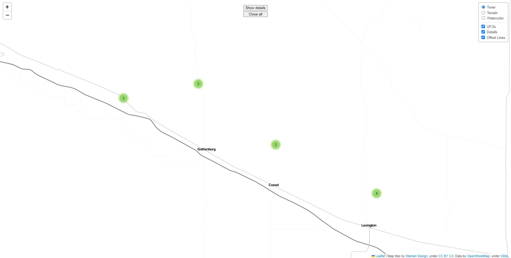
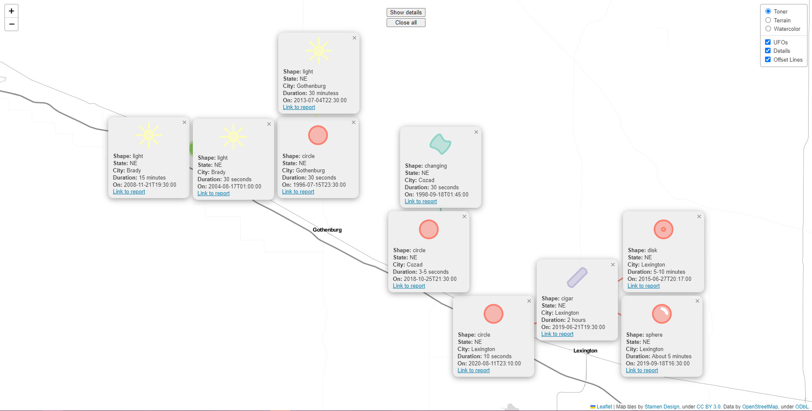

# Are They Real???

## By Jakob Pernsteiner and Elias Kristmann

This project provides an exploratory visualization for UFO sightings reported to the [National UFO Reporting Center](https://nuforc.org/). It uses an aggregated dataset on [data.world](https://data.world/timothyrenner/ufo-sightings) created by Timothy Renner. The visualization provides the possibility to view the details of multiple spatial data points at the same time by positioning the popups via [Minimum-Displacement Overlap Removal for Geo-referenced Data Visualization](https://onlinelibrary.wiley.com/doi/abs/10.1111/cgf.13199).

## Links

[Website](bin)

[Source Code](https://github.com/JakobPer/vis2_aretheyreal)

[Documentation](doc)

# Description

Initially, the website loads all the coordinates and shapes of the UFO sightings. The coordinates of the data points are slightly spatially jittered to prevent them from occupying the exact same coordinates, as the algorithm forbids this (would not terminate).

 Afterwards, if a cluster with less than 50 entries is clicked, the algorithm will rearrange the detail popups and show them. If it contains more than 50 entries, it will zoom to the contained data points.

The number of details to show was limited to 50 because otherwise it would clutter the view too much or the algorithm would take an unreasonable amount of time to finish.

Additionally, if the show details button at the top is clicked, it shows the details of all the data points in view. This only works if there are less than 50 visible.

The clear all button removes all the detail popups again.

In the top right corner different map styles can be selected (Toner, Terrain, Watercolor). Also the UFO clusters, the detail popups and offset lines can be turned on or off separately.

The plus and minus buttons in the top left can be used to zoom.

The detail popups contain some additional information on the UFO sighting and also include a link to the report in the NUFORC database.

### Before arranging the details:

### After arranging the details:

# How to run it locally

If you are missing the converted data you need to convert it first, simply run `python convert.py` in the src directory. This can take a minute or two.

To be able to access the website you need to run it on an webserver, else the scripts will not load properly. A simple python one is provided, simply run `python webserver.py` which hosts it at port `8000`.

# Used Libraries

* Map library
  * [Leaflet.js](https://leafletjs.com/)
* Cluster plugin
  * [Leaflet-markercluster](https://leaflet.github.io/Leaflet.markercluster/)
* CSV library
  * https://github.com/okfn/csv.js/